# oci-auditing
Oracle Cloud Infrastructure Auditing Tool
* automated auditing process of analysing different OCI resources.
* Windows GUI to select just what you needed.
* multiple tenancies, schedule, email reports & lot more.

USE GUI MODE TO GET ALL OPTIONS ACCESSIBLE,
command-line mode is with limited options required for schedulers/automations.

    Commandline Usage of "OCI Auditing Tool":

    Arg 1 = Tenancy Names, each separated by a space
            complete list should be as single argument, so use double-quotes to cover the complete list
            *Mandatory argument

    Arg 2 = Type of analysis:
            compartments = list & analyse Compartments, audits naming formats
            users        = list & analyse Users, audits naming formats
            groups       = list & analyse Groups, audits naming formats
            limits       = list & analyse Service Limits, warnings on near to limits
            policies     = list & analyse Policies, audits for mandatory policies, missing policies, additional policies
            instances    = lists instances created for all the OCI services supported
            events       = list & analyse Audit Events, alerts for all create/modify/terminate events
            networks     = list & analyse VCN and all of it's sub-components, audits CIDR, Protocols
                           [planned to include all other network components in next release]
            all          = all these audits
			[select only required audits, to save big run-times. Using optimization options in configurations can save run-times.]
            *Mandatory argument

    Arg 3 : Options available as of now: sendMail
            -Optional argument

Note: 
   * All alerts are normally highlighted with suitable background colors.
   * selected analysis will always list all respective OCI components in to the report, along with auditing, unless if some components are avoided by user configurations.
   
   
GUI options self-explorable, person who manages OCI, can understand UI easily.
Further how to provide tenancies list into configuration, and all other simple steps are explained below:
  

###### Table of further contents

[Background](#_Toc52579461)

[High-Level Steps](#_Toc52579462)

[Prerequisite](#_Toc52579463)

[Installation](#_Toc52579464)

[Configurations](#_Toc52579465)

[Tool Demo](#_Toc52579466)

[Report Details](#_Toc52579467)

[Email Notifications](#_Toc52579468)

[Appendix](#_Toc52579469)

[User configurations on OCI](#_Toc52579470)

## Background

With the increasing demand for scale of operations in OCI, visibility in managing the resources is becoming as important. While the Audit service provides the necessary governance, however, managing it manually becomes difficult for large and ever-changing infrastructures.

"OCI Audit Tool" helps us in mitigating the manual work and provide an automated way to govern the infrastructure with minimal effort.

## High-Level Steps

* Place OCI Audit Tool in OCI compute or local Windows system.

* Get authentication details: Tenancy OCID, Region, User OCID, API fingerprint.

* Configure the tool to authenticate the required tenancy.

## **Prerequisite**

* A Windows system (cloud or local) to install the tool.

* An advanced editor installed. example: notepad++

* Oracle Cloud Infrastructure account. https://www.oracle.com/cloud/sign-in.html

* An OCI user. A security best practice is to create a new user instead of existing user

* IAM policy for the user. allow group <grp_name> read all-resources in tenancy

* RSA key pair in**PEM format**  to generate API authentication.

* Tenancy OCID, user OCID and fingerprint obtained after adding the public key.

* SMTP/TLS service details for notifications.

 

 

## <a name="_Toc52573354">Installation</a>

Download the windows executable directly from here [compressed with 7zip format], both stable and recent beta versions will be available.

 

* Download the files "OCI Auditing Tool - vX.X" and "configurations\tool.ini".

* Extract exe to your preferred local folder.

* Move "tool.ini" file inside a subfolder named "configurations".

* Add all configurations and credentials in "tool.ini" (explained in the following section).

 

  

 

## <a name="_Toc52573355">Configurations</a>

###### Configuring "tool.ini"

Get User configurations on all tenancies following as steps in: [User configurations on OCI](#_Toc52579470)

- _Note: All lines starting with Hash or colon [ _**#**_ _**;**_ ] are comment lines._

_These comment lines are just for user"s reference._

_ _

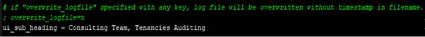

 

* Copy the private key "oci_api_key.pem" under the "configurations" folder created during installation.
    
* Open the "tool.ini" file in an editor and add the tenancy details.

    tenancy_name= <name of your tenancy>
    tenancy_ocid= <OCID of your tenancy>
    user_ocid = <OCID of the user>
    fingerprint = <fingerprint of the user>
    Region = <any subscribed region identifier>
    key_file = <private key local path>

* For multiple tenancies, add multiple sets of entries as below.

 

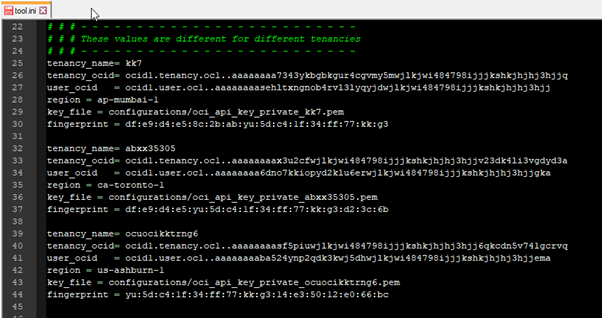

  

 

## <a name="_Toc52573356">Tool Demo</a>

Once the configuration is complete, open "OCI_Auditing_Tool.exe" to launch the tool.

The interface would look like this "

 

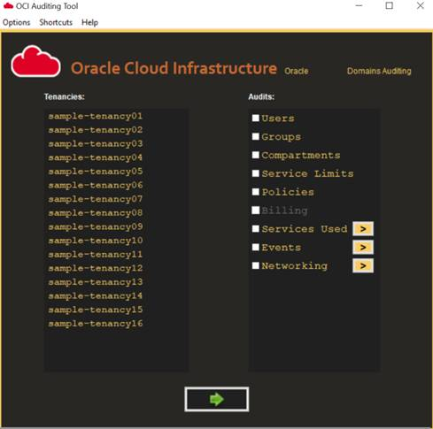

 

 

To test the connectivity, select required tenancies, click on "Options > Connection Check"

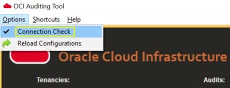

 

 

 

To gather audit details:

* Select the tenancy/s on left.

* Select the type of audits required on right.

******* **Click on the green arrow button at the bottom.****

This will fetch the required information from OCI and generate an audit report in .xlsx format.

 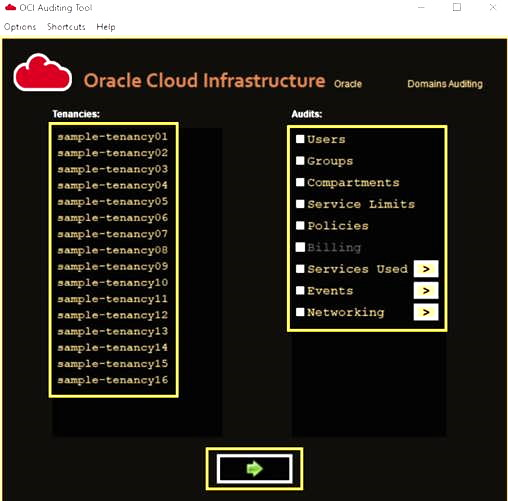

 

- The audit report along with an execution log will be stored in "results" folder.

 

 

 

  

 

## <a name="_Toc52573357">Report Details</a>

* All audit data will be consolidated to one report.

* Data will be spread across multiple tabs with respect to type of audit.

* Report will be named along with generated time-stamp, for future differentiation between multiple reports.

The Audit Report tabs are outlined below.

 

###### <u>Tenancies</u>

 

Report generation timestamp is displayed on top.

 

Shows basic details of tenancies like name, OCID, home-region, subscribed-regions and all Availability Domains.

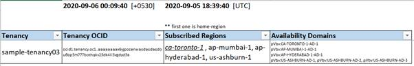

 

 

<u>  
</u>

** **

###### <u>Users</u>

 

Shows all user details fetched from selected tenancies.

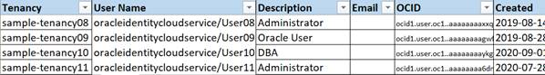

 

**<u>Optional configurations:</u>**

**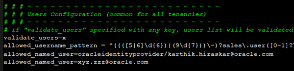**

** **

* allowed_username_pattern : allowed username pattern based on your preferences

* allowed_named_user : any exceptional usernames, which does not follow pattern

###### <u>Groups</u>

Shows all group details fetched from selected tenancies.

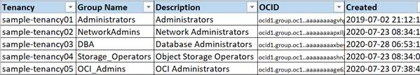

**<u>Optional configurations:</u>**

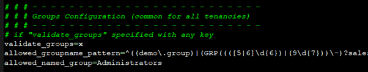

* allowed_groupname_pattern : allowed group-name pattern

* allowed_named_group : any exceptional group names, which does not follow pattern

  

** **

###### <u>Compartments</u>

Shows all compartments, sub-compartments up to any level.

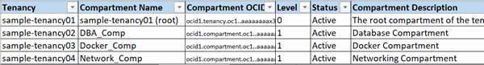

**<u>Optional configurations:</u>**

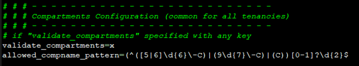

* allowed_compname_pattern : allowed compartment name pattern based on your preferences

  

###### <u>Service Limits</u>

Shows all service-limits, scanning through all available services, and diving deep through all scopes and limits.

also, shows limit usage and availability if required.

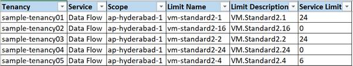

**<u>Optional configurations:</u>**

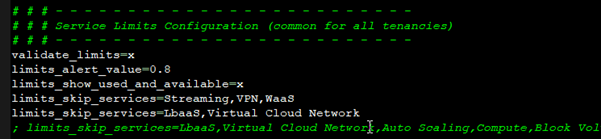

* limits_alert_value : threshold for Service limit alerts

* limits_show_used_and_available : show services used and available also

* limits_skip_services : bypass these services

Marks row,

*   red, if usage is above the limit
*   yellow, if usage is above alert value

  

** **

###### <u>Policies</u>

Shows all policies present in each compartment.

Scans through every policy and all of its statements, and shows as policy statement per row format.

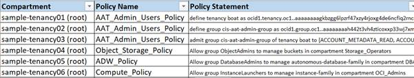

  

###### <u>Services Created</u>

Shows all services created by users, scanning in to every regions, availability domains and, compartments.

 

These OCI services are supported: 

* Compute

* Boot Volume, and Backups

* Block Volume, and Backups

* Volume Group, and Backups

* Dedicated VM Host

* Cluster Network

* Instance Pool

* File System, Mount Target

* Analytics Instance

* Integration Instance

* Load Balancer

* Health Check: HTTP, and Ping

* DB Systems

* Autonomous Databases

* Autonomous Container Databases

* Autonomous Exadata Infrastructure

* Exadata Infrastructure

* VM Cluster

* NoSQL Table

* MySQL DB System

- _You can send request for additional services to get added in to the Tool_

**<u>Optional configurations:</u>**

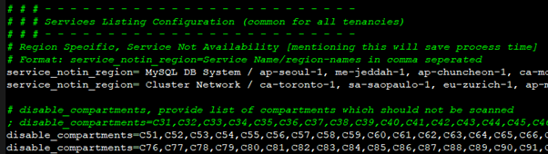

- _These options are for tool runtime optimization only._

  

 

###### <u>Events</u>

Shows all OCI Audit Events like creating or updating instances, listing security lists, route tables, etc.

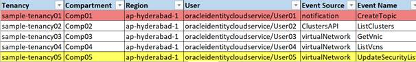

Marks row,

* Red upon creating or deleting a resource.

* Yellow upon updating a resource.

OCI Audit Events can be collected for these date ranges:

* Past 1 hour

* Past 1 day

* Past 1 month

* All events from last run

- _These options are available on tool GUI_

###### <u>Networking</u>

<u>Virtual Cloud Network</u>: Shows VCN details such as VCN name, OCID, CIDR, etc.

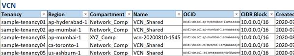

<u>Route Table</u>: Shows Route Tables available along with the implemented route rules.

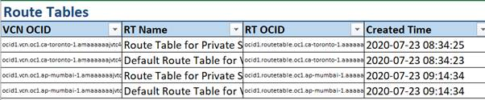

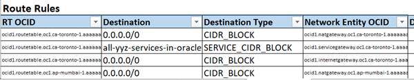

<u>Subnet</u>: Shows a list of all the subnets configured.

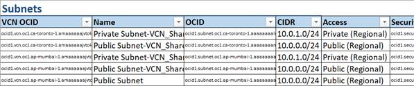

  

<u>Security List:</u>

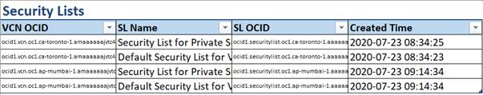

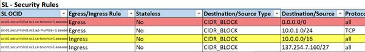

<u>Network Security Groups:</u>

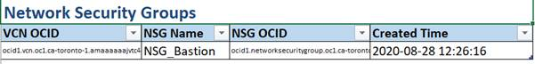

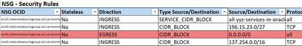

- Rows are color coded as below:

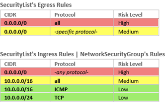

  

## <a name="_Toc52573358">Email Notifications</a>

If you are scheduling this tool for daily or weekly reports, then, email notification feature can send the report right to your inbox.

 

**<u>Configurations for Email Notifications</u>**

 

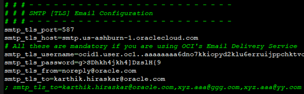

 

 

 

 

 

 

## <a name="_Toc52573359">Appendix</a>

## <a name="_Toc52573360">User configurations on OCI</a>

The details below would be required for the configuration

* RSA key pair in PEM format

* Tenancy name

* Tenancy OCID

* User OCID

* API fingerprint of the user

Login to your OCI console and click on the Profile button > Tenancy.

 

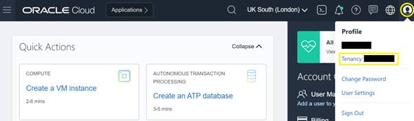

 

 

 

 

On the Tenancy Details page, find the OCID and click on "Show" to view the complete OCID or click on "Copy" to copy it into clipboard and paste on a notepad.

 

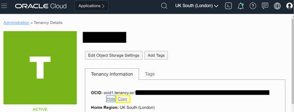

In the OCI console, click on the Profile button > Username.

 

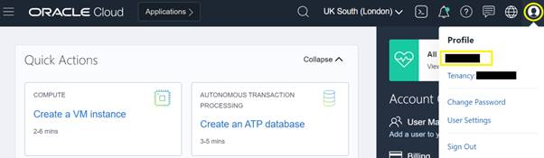

 

On the User Details page, find the user OCID and click on "Show" to view the complete OCID or click on "Copy" to copy it into clipboard and paste on a notepad.

 

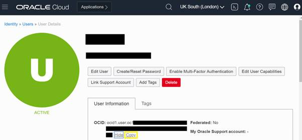

 

 

* Upload the public key "oci_api_key_public.pem" generated.

................................................................................ [How to generate: [RSA key pair generation](#_Toc52573361)]
................................................................................ [How to generate: [RSA key pair generation](#./doc/rsa_key_pair_generation.md)]

* On the User Details page, scroll down to Resources and click on API Keys > Add Public Key.

* Select or drop the public key and hit "Add".

 

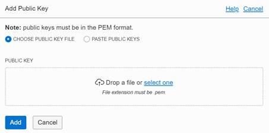

 

* A fingerprint will be generated. Copy this fingerprint and keep handy on a notepad.

 

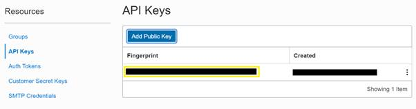

 

_Note: In similar way, get details of all other tenancies in scope for audit._

_ _

_ _

