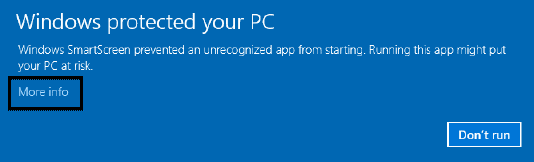

# CloudGuard v/s OCI Audit Tool 

**CloudGuard**, is  security issues detector
* it will identify security concerns and helps user to fix it
* providing some fixes in few automated clicks and remaining manually with suggestions

&nbsp;

**OCI Audit Tool**, scope is different
* it shows tenancies auditable data including CloudGuard detections
* auto audits the common scenarios from live data grabbed from tenancies, based on user configurations
* shows end to end report, allowing users to take further actions

&nbsp;

# <a name=disable_compartments>How to Disable Compartments?</a>

Many times you may not need to analyse all compartments.

Use config tag `disable_compartments` and add compartment names that you do not want to analyse in comma seperated formats.
You can use this tag multiple times also.

```ini
# disable_compartments, provide list of compartments which should not be scanned
disable_compartments=C101,C102,CompartmentABC,XYZ
; disable_compartments=Lina_Comp,tenancy05 (root),Network_Comp
```
<u>_Hint:_</u>

_* Run OCI Audit Tool, without selecting any audits, it will produce report with all compartment names listed_

_* Get to be ignored compartments in to this tag_

&nbsp;

# <a name=windows_preventing>Windows preventing, how to proceed?</a>

For some users, when you run any new application for the first time, windows may stop it with message like "Windows Protected your PC, Windows Defender Smart Screen prevented an unrecognized app from starting. Running this app might put your PC at risk. More Info"

Windows Defender prevent you running apps that are unrecognized by the Windows software database.

However, this warning sometimes is annoying. For example, you know this app is secure, obtained from a trustworthy source.
Besides, it seems to show an only option – Don’t run. What should you do?



You can click the "More info" link that is displayed beneath the message.

In the pop-up window, you can know the app name and publisher. You may note that the publisher is unknown. Don’t panic since not every developer registers with Microsoft.

 Then, click the Run anyway button to bypass the Windows Defender SmartScreen warning and continue using the app.

