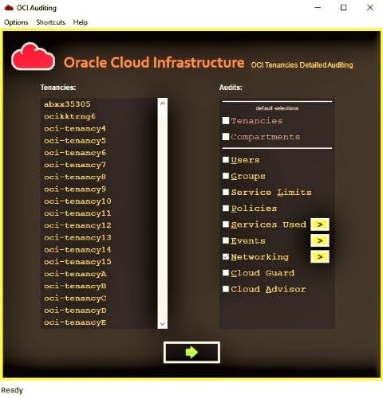

# GUI

Open "OCI_Auditing_Tool.exe" directly from windows folder to launch the GUI of the tool.

 

# Get audit report:
* Select the tenancy/s on left.
* Select the type of audits required on right.
* Click on the green arrow button at the bottom.

This will fetch the required information from OCI and generate an audit report in .xlsx format.

The audit report along with an execution log will be stored in `results` folder.

 

[INDEX](../README.md#toc)

 

# Menu Bar Features

## Menu: Options

### Connection Check
To test the tenancy connectivity, select required single or multiple tenancies, and perform "Connection Check"

### Open Configurations
Opens configuration file `configurations/tool.ini` in your default `ini` extension associated editor.

_[for easy editing of configurations, associate advanced text editors like notepad++]_

### Reload Configurations
If configurations file is modified while UI is opened, then "Reload Configurations" to load the chnages.

 

## Menu: Shortcuts
These are just few of the keyboard shortcuts provided on menu, for ease in operating the tool.

### Service Window
Opens service selection window, where you can select different OCI services which you want to get listed in to the report.

_Note: once this window is opened, "Services Used" audit will be auto selected_

### Networking Window
Opens networking types selection window, where you can select different OCI networks services. which you want to audit.

_Note: once this window is opened, "Networking" audit will be auto selected_

### Start
Starts connecting to selected tenancies and gets the data for listing, auditing and creates the final report.

 

## Menu: Help

### Document
Opens this tool document.

It's in pretty detailed, and easy to understand the tool.

### About
Shows tool's major information.

### Credits
Shows info on the contributions made in creation of OCI Auditing tool.

### Check Updates
Checks if any recent updates available.

_You can also use this option, to see all releases (including latest, stable, beta releases)_

### Submit
Here you will get this 3 options:
* **Feedback:** _Submit any of your feedbacks_
* **New Feature:** _Propose enhancements or new feature request with details_
* **Defect:** _Submit issue/bug/defect that you found with details for the fix_

### References
Navigations to reference documents.

 

[INDEX](../README.md#toc)

 
