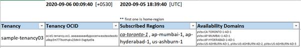
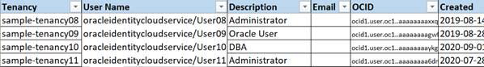
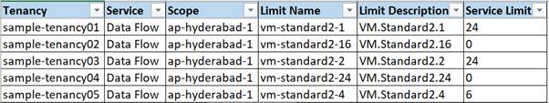
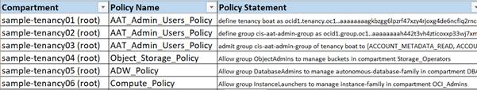
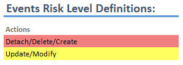

# OCI Auditing

<div style="text-align:center">
&nbsp;
&nbsp;

## DOWNLOAD
[LINUX package ](https://github.com/KsiriCreations/oci-auditing/releases/download/3.6.16/oci-auditing-v3616)
[WINDOWS executable ](https://github.com/KsiriCreations/oci-auditing/releases/download/3.7/OCI_Auditing_Tool-v3.7.exe)

</div>

&nbsp;
&nbsp;

## <a name="toc">Index

[Installation Steps ](#installation_steps)
[Introduction ](#intro)
[Commandline ](../cmd_line_options.md)
[Windows GUI ](../gui_options.md)
[Prerequisite ](#prerequisite)
[Configurations ](#config)
[Audit Details ](#report_details)
[Email Notifications ](#email)

[FAQs ](../FAQs.md)
[Roadmap ](https://github.com/KsiriCreations/oci-auditing/projects/1)


&nbsp;

# <a name="installation_steps"></a>Installation steps for first time usage
* Download direct, one click executable for your platform, from [RELEASES](https://github.com/KsiriCreations/oci-auditing/releases)
    - Place executable file in your preferred directory
    - On first run under `configurations` folder [`tool.ini`](https://github.com/KsiriCreations/oci-auditing/raw/master/configurations/tool.ini) a initial configuration will be automatically placed
* Configure tenancies authentication and if required optional configurations.
\{[how to configure](#config) and [prerequisite](#prereq)\}

<br />

[INDEX](#toc)

&nbsp; 

# <a name="intro"></a>Introduction

With the increasing demand for scale of operations in Oracle Cloud Infrastructure, visibility in managing the resources is becoming as important.

While the Audit service provides the necessary governance, however, managing it manually becomes difficult for large and ever-changing infrastructures.

"OCI Auditing Tool" helps us in mitigating the manual work and provide an automated way to govern the infrastructure with minimal effort.

* Audits & Reports on: 
    * Users, Groups, Compartments, Service Limits
    * Policies, all listed on a single sheet helps easy tracking by applying filters
    * Instances or Services used
    * Events, track every actions, and keep archive of what and all happened in your tenancies
    * Networking alerts on all OCI network components
    * Cloud Guard, get these alerts also right into this same report
* supports multiple tenancies in a one go.
* schedule daily, monthly or as needed for reporting/archiving tenancies details.
* email reports & lot more features.
* with GUI, and also command-line access.

[INDEX](#toc)

<br />

# <a name="prerequisite"></a><a name="prereq"></a>Prerequisite

* A Windows system (cloud or local) to setup the tool.
* An advanced text editor is preferred. `example: notepad++`
* Oracle Cloud Infrastructure, OCI account.
    - An OCI user.
        - security best practice is to create a new user with minimal permissions required
        - `allow group <grp_name> read all-resources in tenancy`
* RSA key pair in PEM format, to form API authentication.
* Tenancy OCID, user OCID and fingerprint obtained after adding the public key.
* SMTP/TLS configurations for mail notifications (optional).

[INDEX](#toc)

&nbsp;  

# <a name="config">Configurations - "tool.ini"</a>

_All lines starting with Hash or colon [ `# ;` ] are comment lines._
```ini
# use hash # symbol for notes, comments or any explanations
; use semi-colon ; to switch between enabling/disabling tags

### Examples ###

# if "overwrite_logfile" specified with any key, log file will be overwritten [comments]
; overwrite_logfile=x [This tag is Disabled now]
overwrite_logfile=x [This tag is Enabled now]

# This sub heading will be shown on GUI
; ui_sub_heading=XYZ groups, tenancies auditing
ui_sub_heading=OCI tenancies detailed auditing
```
Get User configuration details following as steps in: [User configurations on OCI](../user_configurations_on_oci.md)
* Preferred to copy private key/s under the `configurations` folder.
* Open the `tool.ini` file in text editor and add the tenancy details.
```ini
    tenancy_name= <name of your tenancy>
    tenancy_ocid= <OCID of your tenancy>
    user_ocid = <OCID of the user>
    fingerprint = <fingerprint of the user>
    Region = <any subscribed region identifier>
    key_file = <private key local path>
```

\* For multiple tenancies, add multiple sets of entries as below.


\* Further additional configurations are shown along with individual report snaps.

[INDEX](#toc)

<br />

__IMPORTANT NOTE:__
> _All configuration values like OCIDs, Names etc., are shown dummy in this document, seems like originals, for clear understanding._

> _Replace with right values in your configurations!_

<br />

# <a name="report_details">Report Details</a>

\* All audit data will be consolidated to one report.

\* Data will be spread across multiple tabs with respect to type of audit.

\* Report will be named along with generated time-stamp, for future differentiation between multiple reports.

<br />

The Audit Report tabs are outlined below.


## Tenancies

Report generation timestamp is displayed on top.


Shows basic details of tenancies like name, OCID, home-region, subscribed-regions and all Availability Domains.



<br />

## Users

Shows all user details fetched from selected tenancies.




### Optional configurations:

```ini
# if "validate_users" specified with any key, users list will be validated, else will be just listed.
validate_users=x
allowed_username_pattern = ^((([5|6]\d{6})|(9\d{7}))\-)?sales\.user([0-1]?\d{2})$
allowed_username_max_number = 199
allowed_named_user=oracleidentityprovider/karthik.hiraskar@oracle.com
allowed_named_user=xyz.zzz@oracle.com
```

\* `allowed_username_pattern` : pattern based on your preferences

\* `allowed_named_user` : any exceptional usernames, which does not follow pattern

<br />

## Groups

Shows all group details fetched from selected tenancies.


### Optional configurations:

```ini
validate_groups=x
allowed_groupname_pattern=^((demo\.group)|(GRP((([5|6]\d{6})|(9\d{7}))\-)?sales\.user))([0-1]?\d{2})$
allowed_groupname_max_number=199
allowed_named_group=Administrators
```

\* `allowed_groupname_pattern` : based on your preferences

\* `allowed_named_group` : any exceptional group names, which does not follow pattern

<br />

## Compartments

Shows all compartments, sub-compartments up to any level.


### Optional configurations:

```ini
; validate_compartments=x
; allowed_compname_pattern=(^([5|6]\d{6}\-C)|(9\d{7}\-C)|(C))[0-1]?\d{2}$
```

<br />

[INDEX](#toc)

<br />

## Service Limits

Shows all service-limits, scanning through all available services, and diving deep through all scopes and limits.

also, shows limit usage and availability if required.



### Optional configurations:

```ini
validate_limits=x
limits_alert_value=0.8
limits_show_used_and_available=x
limits_skip_services=Streaming,VPN,WaaS
;limits_skip_services=LbaaS,Virtual Cloud Network,Integration,Notifications,Resource Manager
; limits_skip_services=Auto Scaling,Compute,Block Volume,API Gateway,Email Delivery,Functions
```

\* `limits_alert_value` : threshold for Service limit alerts

\* `limits_show_used_and_available` : show count of services used and available also

\* `limits_skip_services` : Donot alayze these services

_Marks row,_
*   red, if usage is above the limit
*   yellow, if usage is above alert value

<br />

## Policies

Shows all policies present in each compartment.

Scans through every policy and all of its statements, and shows as policy statement per row format.



### Optional configurations:

```ini {.line-numbers}
; validate_policies=x
# # Mandatory Policies # #
root_policy=ALLOW ANY-USER TO READ ALL-RESOURCES IN TENANCY
root_policy=allow service PSM to inspect tenant in tenancy
root_policy=allow service PSM to inspect compartments in tenancy
root_policy=ALLOW GROUP Administrators to manage all-resources IN TENANCY
# RULES for "compartment_policy"
# replace Compartment Name by tag '<compartment-name>'
# replace Group Name by tag <group-name>
compartment_policy=ALLOW GROUP <group-name> TO MANAGE object-family IN COMPARTMENT <compartment-name>
compartment_policy=ALLOW GROUP <group-name> to manage all-resources IN COMPARTMENT <compartment-name>
compartment_policy=ALLOW SERVICE PSM TO INSPECT VCNS IN COMPARTMENT <compartment-name>
compartment_policy=ALLOW SERVICE PSM TO USE BUCKETS IN COMPARTMENT <compartment-name>
```

_Note: These policies configuration parameters are just a trial implementation!_

<br />

[INDEX](#toc)

<br />

## Services Created / Instances

Shows all services created by users, scanning in to every regions, availability domains, and compartments.

These OCI services are supported: 
* Compute Instances
* Custom Images
* Boot Volume, and Backups
* Block Volume, and Backups
* Volume Group, and Backups
* Dedicated VM Host
* Cluster Network
* Instance Pool
* File System, Mount Target
* Analytics Instance
* Integration Instance
* Load Balancer
* Health Check: HTTP, and Ping
* DB Systems
* Autonomous Databases
* Autonomous Container Databases
* Autonomous Exadata Infrastructure
* Exadata Infrastructure
* VM Cluster
* NoSQL Table
* MySQL DB System
* Load Balancer
* Data Science


_You can [submit request](https://github.com/KsiriCreations/oci-auditing/issues/new?title=New%20Service:%20%3CReplace%20with%20Feature%20Title%3E&body=%3CReplace%20with%20your%20detailed%20comments%20of%20any%20new%20feature%20or%20enhancements%20that%20need%20to%20be%20incorporated%20in%20OCI%20Auditing%20Tool%3E) for additional services to get added in to the Tool_

[>> more details](../services_created.md)

[INDEX](#toc)

<br />

## <a name="events">Events</a>

Shows each and every Events performed.


* OCI Audit Events can be collected for these date ranges:
    * Past 1 hour
    * Past 1 day
    * Past 1 month
    * All events from last run

    all options available on UI, command-line always selects events from last run

> 
 
### Optional configurations:

```ini
events_show_all=x
```

_Note: By default audit events identified for alert will only be listed, use `events_show_all` to show everything_

<br />

[INDEX](#toc)

<br />

## <a name="networks">Networking</a>
Get fine reporting with audits on these supported network components:
* VCN
* Route Table
* Subnet
* Security List
* Network Security Group
* Internet Gateway
* NAT Gateway
* Service Gateway
* DRG attachments to VCN
* Local Peering Gateway
* DRG


[>> more details](../networking.md)

<br />

[INDEX](#toc)

<br />


# <a name="email">Email Notifications</a>

If you are scheduling this tool for daily, weekly reports, then email notification feature can send the report right to your inbox.

### Configurations for Email Notifications

```ini
# # # - - - - - - - - - - - - - - - - - - - - - - - - -
# # # SMTP [TLS] Email Configuration
# # # - - - - - - - - - - - - - - - - - - - - - - - - -
sendmail_onlyif_audit_issues=x
smtp_tls_port=587
smtp_tls_host=smtp.us-ashburn-1.oraclecloud.com
# All these are mandatory if you are using OCI's Email Delivery Service
smtp_tls_username=ocid1.user.oc1..aaaaaaaa6dno7kkiosss2klu6@ocid1.tenancy.oc1..aaax2cfa3r.fm.com
smtp_tls_password=g>SDhuu
smtp_tls_from=noreply@your-domain.com
smtp_tls_to=your-name@your-domain.com
; smtp_tls_to=karthik.hiraskar@oracle.com,xyz.aaa@ggg.com,xyz.aaa@yy.com
```

_Note:_
> _Mailing functionality may give error if VPN or antivirus blocks the connection._

> _Email Notifications are required only when we run on scheduler_
    - _With GUI, reports will be right on your system, so email feature is only enabled for CLI runs._

[INDEX](#toc)

<br />
<br />

## Similar Tools for IDCS/OCIC
* IDCS Auditing Tool: Lists Users, Groups, AppRoles
* IDCS Instances Listing Tool: Lists all instances, means all service created.
