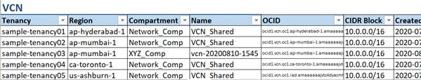

### Virtual Cloud Network:
When networking is selected, VCN details are by default listed.

### Route Table:
Shows Route Tables available along with the implemented route rules.

### Subnet:
Shows a list of all the subnets configured.

### Security List:

### Network Security Groups:

 

Risks highlighted as below:

